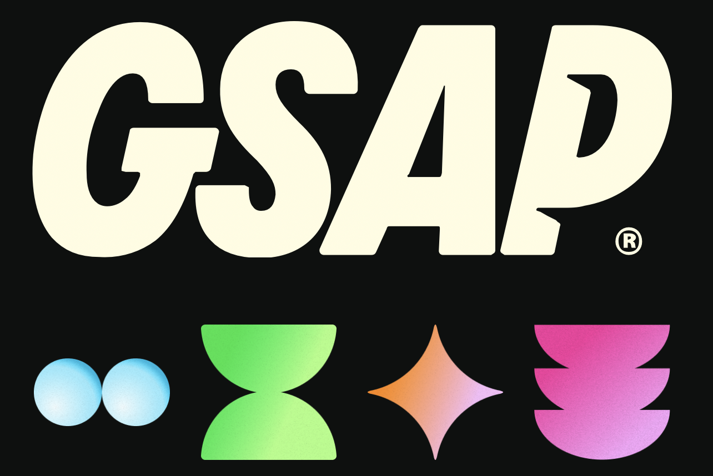

      
  <h1 align="center">GSAP BASICS</h3>

  
A concise, hands-on workshop for crafting delightful, high-performance web animations with GSAP.

<table style="width:100%; border-collapse:separate; border-spacing:12px 12px;">
  <tr>
    <td style="vertical-align:top; width:48%;">
      

        <strong>📋 Table of Contents</strong>
        <ul style="list-style:none; padding:8px 0 0 0; margin:0; text-align:left;">
          <li>✨<a href="#introduction">Introduction</a></li>
          <li>⚙️<a href="#tech-stack">TechStack</a></li>
          <li>🚀<a href="#quick-start">QuickStart</a></li>
        </ul>
      

    </td>

   <td style="vertical-align:top; width:48%;">
      

        <strong>Project</strong>
        
Practical examples showing how to compose timelines, apply easing, and optimize animations for consistent performance across browsers.

      

    </td>
  </tr>
</table>

  <h2 style="margin:0 0 8px 0;">✨ Introduction</h2>
  
This repository is a hands-on workshop that teaches smooth, engaging animations using GSAP (GreenSock Animation Platform). Through clear, framework-agnostic examples you'll learn to compose timelines, apply easing, and optimize for consistent performance across browsers.

  <h2 style="margin:0 0 8px 0;">⚙️ Tech Stack</h2>
  <ul style="text-align:left; margin:0; padding-left:16px;">
    <li><strong><a href="https://react.dev/reference/react">React</a></strong> — component-driven UI to organize interactive examples.</li>
    <li><strong><a href="https://greensock.com/gsap/">GSAP</a></strong> — high-performance animation toolkit and timeline system.</li>
    <li><strong><a href="https://vitejs.dev/guide/">Vite</a></strong> — fast dev server and build tool for instant feedback.</li>
    <li><strong><a href="https://www.npmjs.com/">npm</a></strong> — package manager to install dependencies and run scripts.</li>
  </ul>

  <h2 style="margin:0 0 8px 0;">🚀 Quick Start</h2>

  
<strong>Prerequisites</strong>

  <ul style="text-align:left; margin:0 0 12px 0; padding-left:16px;">
    <li><a href="https://git-scm.com/">Git</a></li>
    <li><a href="https://nodejs.org/en">Node.js</a></li>
    <li><a href="https://www.npmjs.com/">npm</a></li>
  </ul>

  
<strong>Clone the repo</strong>

  

    <button style="padding:6px 10px; border-radius:6px; border:1px solid #0b8457; background:#0b8457; color:#fff; font-weight:700; cursor:pointer;"
      onclick="(async()=>{const p=this.nextElementSibling;await navigator.clipboard.writeText(p.innerText);const t=this.textContent;this.textContent='Copied';setTimeout(()=>this.textContent=t,1500);})();"></button>
    <pre style="background:#ffffff; padding:8px; border-radius:6px; overflow:auto; text-align:left; border:1px solid #eee;"><code style="color:#111; font-weight:700; font-family:ui-monospace, SFMono-Regular, Menlo, Monaco, 'Roboto Mono', 'Courier New', monospace;">git clone https://github.com/mohitjoping/gsapBasics.git
cd gsapBasics</code></pre>
  

  
<strong>Install</strong>

  

    <button style="padding:6px 10px; border-radius:6px; border:1px solid #0b8457; background:#0b8457; color:#fff; font-weight:700; cursor:pointer;"
      onclick="(async()=>{const p=this.nextElementSibling;await navigator.clipboard.writeText(p.innerText);const t=this.textContent;this.textContent='Copied';setTimeout(()=>this.textContent=t,1500);})();"></button>
    <pre style="background:#ffffff; padding:8px; border-radius:6px; overflow:auto; text-align:left; border:1px solid #eee;"><code style="color:#111; font-weight:700; font-family:ui-monospace, SFMono-Regular, Menlo, Monaco, 'Roboto Mono', 'Courier New', monospace;">npm install</code></pre>
  

  
<strong>Run</strong>

  

    <button style="padding:6px 10px; border-radius:6px; border:1px solid #0b8457; background:#0b8457; color:#fff; font-weight:700; cursor:pointer;"
      onclick="(async()=>{const p=this.nextElementSibling;await navigator.clipboard.writeText(p.innerText);const t=this.textContent;this.textContent='Copied';setTimeout(()=>this.textContent=t,1500);})();"></button>
    <pre style="background:#ffffff; padding:8px; border-radius:6px; overflow:auto; text-align:left; border:1px solid #eee;"><code style="color:#111; font-weight:700; font-family:ui-monospace, SFMono-Regular, Menlo, Monaco, 'Roboto Mono', 'Courier New', monospace;">npm run dev</code></pre>
  

  
Open <a href="http://localhost:5173">http://localhost:5173</a> in your browser.

Reference by -